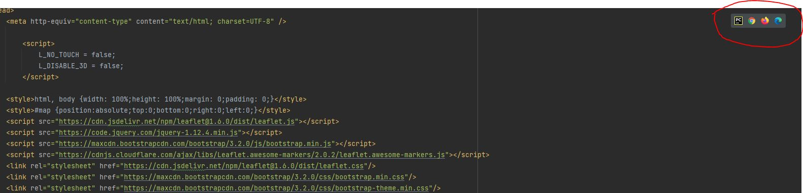
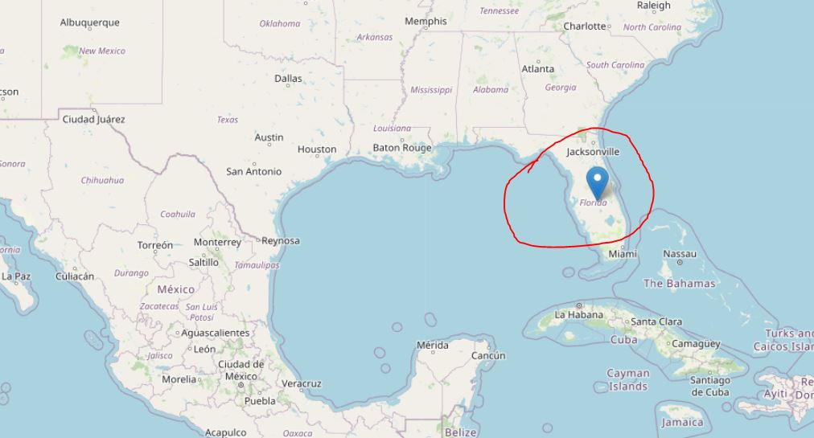

### pip install phonenumbers ; pip install opencage ; pip install folium 

#### enter a mobile number with the country code like +1 (USA) at the beginning

#### for an API key, sign up for [opencage](https://opencagedata.com/). It's free so don't worry about paying for an API Key

#### to search for the coordinates on a map, just copy-paste them to google maps, or select one of the browser icons in the myMap.html file:
 

